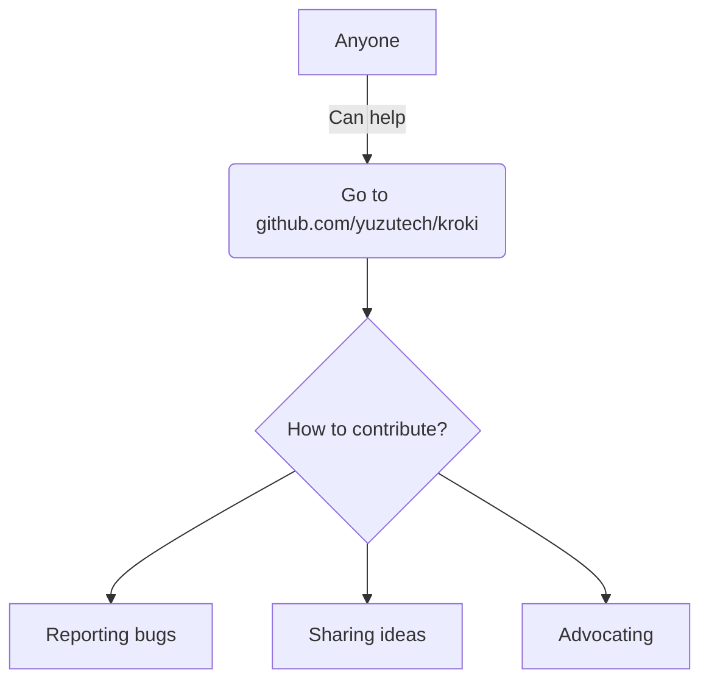

# Mermaid


# Block Diagram
```blockdiag
blockdiag {
    blockdiag -> generates -> "block-diagrams";
    blockdiag -> is -> "very easy!";

    blockdiag [color = "greenyellow"];
    "block-diagrams" [color = "pink"];
    "very easy!" [color = "orange"];
}
```

# Nomnoml
```nomnoml
[Pirate|eyeCount: Int|raid();pillage()|
    [beard]--[parrot]
    [beard]-:>[foul mouth]
  ]
  
  [<abstract>Marauder]<:--[Pirate]
  [Pirate]- 0..7[mischief]
  [jollyness]->[Pirate]
  [jollyness]->[rum]
  [jollyness]->[singing]
  [Pirate]-> *[rum|tastiness: Int|swig()]
  [Pirate]->[singing]
  [singing]<->[rum]
  
  [<start>st]->[<state>plunder]
  [plunder]->[<choice>more loot]
  [more loot]->[st]
  [more loot] no ->[<end>e]
  
  [<actor>Sailor] - [<usecase>shiver me;timbers]
  ```